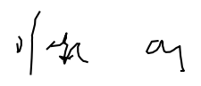

<div align="center">


<b>Diffusion Model for Handwriting Generation</b>

[](https://www.codefactor.io/repository/github/sleep3r/Diffusion-Handwriting-Generation.pytorch)
</div>

----

## Data preparation

### 1. Download IAM Handwriting Database

This project trains on the **IAM Online Handwriting Database** (i.e. pen trajectory / stroke data, not only offline images).

You need to download the following files from [IAM Handwriting Database](https://fki.tic.heia-fr.ch/databases/iam-handwriting-database) (registration required):

- **ascii-all** (e.g. `ascii-all.tar` / `ascii-all.tgz`) - Per-form transcription files (the dataset code reads `.../ascii/<id[:3]>/<id[:7]>/<id>.txt`)
- **lineImages-all** - Line images (TIFF/PNG depending on the archive you download)
- **lineStrokes-all** - Individual XML files with stroke data for each line (contains `<StrokeSet>` with `<Point ...>`). ⚠️ Make sure you download **line-level strokes**, not form-level metadata.

### 2. Extract files

Extract the downloaded archives to the `data/` directory with the following structure:

```bash
data/
├── ascii/
│   └── a01/a01-000/
│       ├── a01-000u.txt
│       ├── a01-000x.txt
│       └── ...
├── lineImages/
│   └── a01/a01-000/
│       ├── a01-000u-01.tif
│       ├── a01-000u-02.tif
│       └── ...
└── lineStrokes/
    └── a01/a01-000/
        ├── a01-000u-01.xml  (with StrokeSet data)
        ├── a01-000u-02.xml
        └── ...
```

**Important:** `lineStrokes/` must contain individual XML files for each line (e.g., `a01-000u-00.xml`) with `<StrokeSet>` elements containing stroke points, NOT form-level metadata XML files.

## Install

This project uses [uv](https://github.com/astral-sh/uv) for dependency management.

```bash
# Install uv if you haven't already
curl -LsSf https://astral.sh/uv/install.sh | sh

# Install dependencies
make install
```

## Train

First, configure your training in `configs/<cfg>.yml`:

```yml
experiment:
  name: <exp_name>
  work_dir: <work_dir>
  data_dir: <data_dir>
```

Then, run:

```bash
make train CONFIG=<cfg>.yml
```

## Inference

To generate handwriting from text using a trained model:

```bash
make infer TEXT="Follow the White Rabbit" \
           EXP="./data/best_exp" \
           OUTPUT="prediction"
```

This will look for the configuration and weights in the specified experiment directory.

### Pretrained Model

We provide a pretrained model that achieves good results. The artifacts are located in `data/best_exp/`:
- `config.yml`: Best training configuration
- `model_final.pth`: Trained model weights
- `run.log`: Training log
- `report.json`: Final metrics

**Example Output:**

Prompt: *"Follow the White Rabbit"*



## References

|Papers|
|---|
| [[1]](https://arxiv.org/abs/2011.06704) Luhman, Troy, and Eric Luhman. "Diffusion models for handwriting generation." arXiv preprint arXiv:2011.06704 (2020). |
